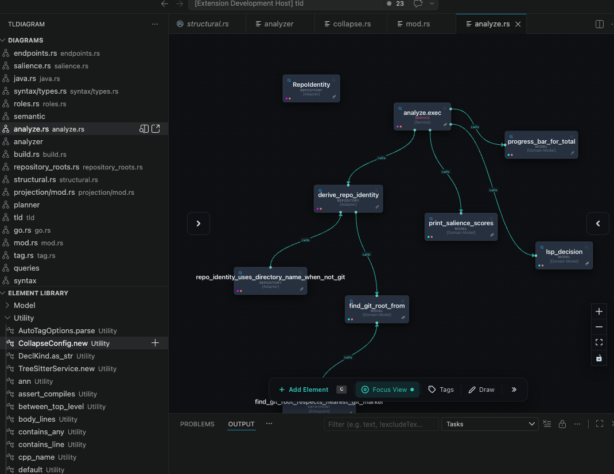

# tlDiagram for VS Code

Browse and edit tlDiagram architecture diagrams without leaving VS Code. The extension is backed by the local `tld` CLI and uses the open-source core UI from `tld/frontend`.

## Features

### Diagram editor in a webview panel
Open any diagram from the Diagrams tree and the full React canvas loads inside VS Code.

### Native sidebar tree views
The extension contributes two views in the **tlDiagram** activity bar container:

| View | What it shows |
|---|---|
| **Diagrams** | Diagram hierarchy, including parent/child relationships, with create, rename, delete, open, and open-in-browser actions |
| **Element Library** | Reusable elements grouped by type, with an **Add to Diagram** action that places the object into the active diagram |

### Workspace source linking
Inside the webview, the source picker can browse workspace files and ask VS Code for symbols in the selected file. The selected link is stored in the same shape the web app uses, so links work in both environments.

Clicking **Open in Editor** jumps to the linked file and line.

### Local CLI mode
The extension starts `tld watch` for the current workspace and talks to the local CLI HTTP API. Set `tlDiagram › Cli Path` if `tld` is not on `PATH`.

### Logging
All extension activity is written to the **tlDiagram** output channel. The verbosity is controlled by `tldiagram.logLevel`.

## Commands

| Command | Where it appears | Description |
|---|---|---|
| `tlDiagram: Refresh Diagrams` | Command palette, tree toolbar | Re-fetch diagrams and refresh the object library |
| `tlDiagram: New Diagram` | Command palette, tree toolbar | Create a blank diagram |
| `Open Diagram` | Diagram item context menu | Open the selected diagram in the webview panel |
| `Open in Browser` | Diagram item context menu | Open the selected diagram on the local tld server |
| `Rename Diagram` | Diagram item context menu | Rename the selected diagram |
| `Delete Diagram` | Diagram item context menu | Delete the selected diagram |
| `Add to Diagram` | Object Library item context menu | Place the selected object into the active diagram |
| `tlDiagram: Show Logs` | Command palette | Open the tlDiagram output channel |

## Requirements

- VS Code 1.85+
- The `tld` CLI
- The extension and webview bundles must be built before loading from source
